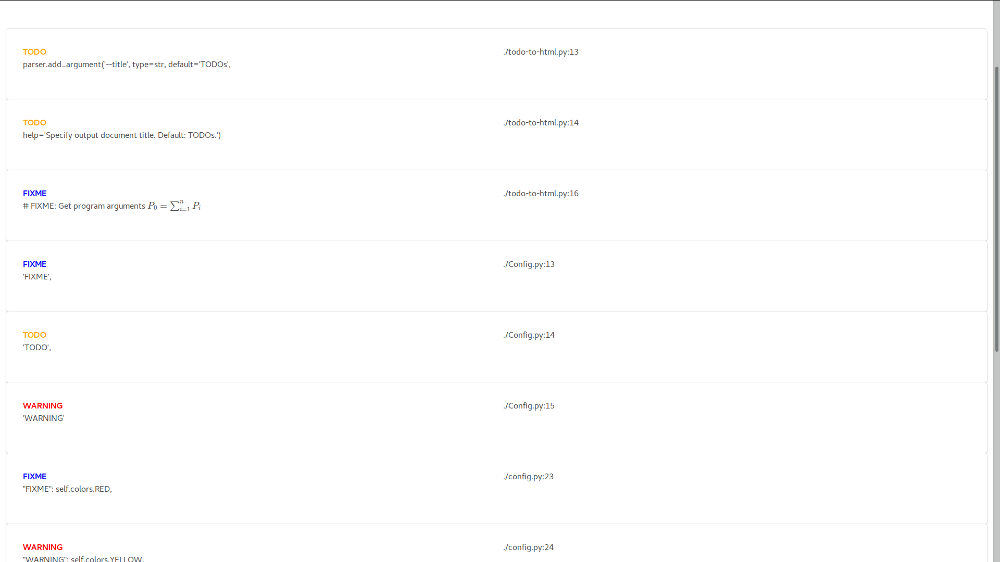

# show-todo
Shows TODOs, FIXMEs, etc. in a project.

## Usage
To use it with the default configuration, just run the script on the project directory.

## Configuration
Configuration is done by editing `config.py` as needed, adding pairs of regular expressions and ANSI escape sequences for colors.

By default it looks on files that match any of the regular expressions in a file called `.rules`. Another file can be specified using the `-f` flag.